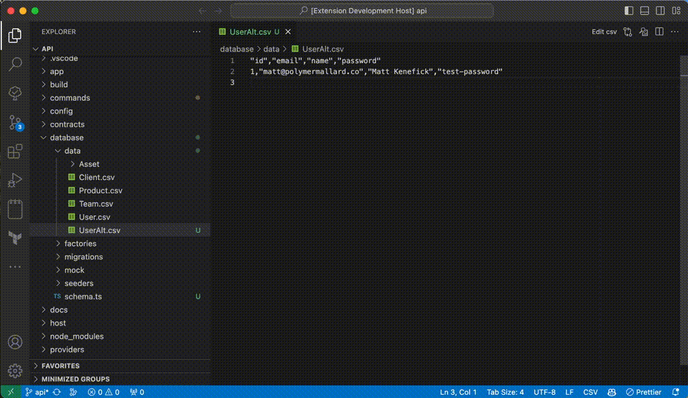

# GPT Template

[](https://marketplace.visualstudio.com/items?itemName=polymermallard.gpt-template)
[](https://marketplace.visualstudio.com/items?itemName=polymermallard.gpt-template)
[](https://www.patreon.com/mattkenefick)
[](https://paypal.me/polymermallard)

Creates a new file using an existing one as a template.



## Usage

Right click a file in the tree explorer and select "Generate using this as template." OR open a file, press Cmd+P, search for "Generate using this as template."

You will be prompted for what you want to create. An example might be "Create a database migration for UserDetail using key value fields."

## Configuration

It currently only requires an OpenAI API token to applied to:

```
	"gpt-template.token": "sk-qkjKAcpQTPGKLEkFfvDbT3BlbkFJ...",
```

## Release Notes

### 0.2.0

-   Update app icon
-   Add GPT streaming
-   Update example GIF
-   Use Settings class

### 0.1.0

Initial release
